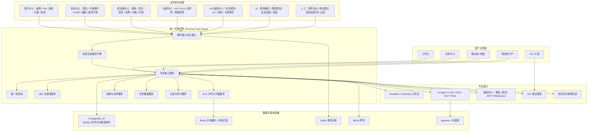
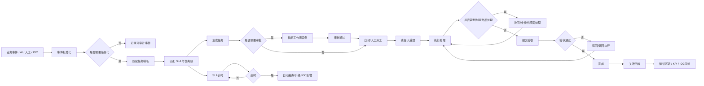
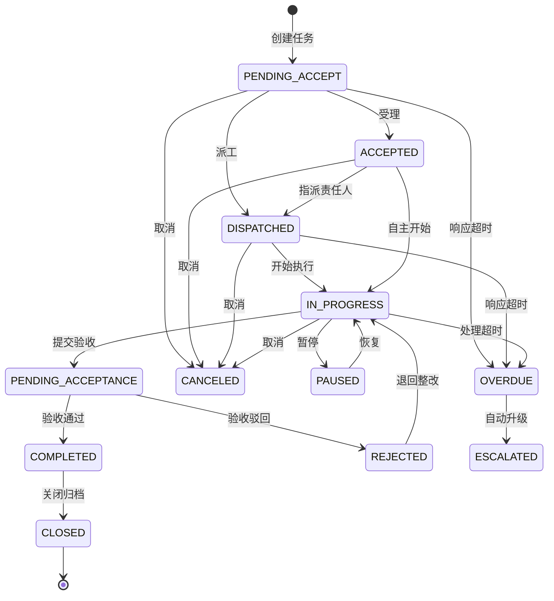
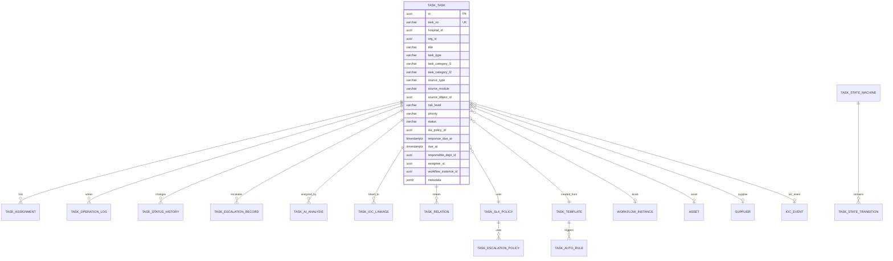
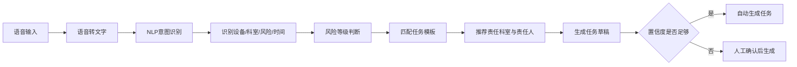
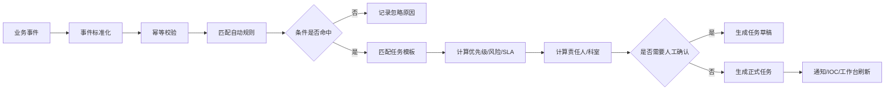

# 统一任务引擎设计 V1.0

# 《统一任务引擎设计 V1.0》

统一任务引擎（Universal Task Engine）是医院医学装备运营 OS 的核心闭环中枢。它把工单、PM、巡检、风险、不良事件、计量、辐射安全、医用气体、采购、财务、供应商、应急、AI 预警、IOC 告警等业务全部收敛为统一任务，形成：

```
事件 -> 任务 -> 派工 -> 执行 -> 验收 -> 闭环
```

本设计与现有文档约束保持一致：

- API 使用统一前缀 `/api/v1`，响应信封 `{code,message,data}`。
- 现有一期工程可按 FastAPI 模块化单体先落地，目标架构预留 Spring Boot + Flowable/Camunda + Kafka 微服务化演进。
- 任务引擎不替代工作流引擎：任务引擎负责运营闭环、状态、SLA、派工、升级和 IOC 联动；工作流引擎负责审批、条件分支、会签、退回和流程合规。

---

## 一、总体目标

统一任务引擎建设目标是成为全院统一任务运营中枢：

| 目标 | 设计要求 |
|---|---|
| 所有业务统一任务化 | 所有业务事件必须转为 `task.task` 或明确标记为无需任务化的可审计事件 |
| 所有任务统一状态机 | 使用统一主状态，按任务类型扩展子状态和扩展动作 |
| 所有事件统一派单 | 规则派单、人工派单、AI 推荐派单、IOC 指挥派单并存 |
| 所有任务统一 SLA | 响应时限、处理时限、暂停计时、恢复计时、升级策略统一计算 |
| 所有任务统一升级 | 超时催办、科主任升级、分管领导升级、院级督办可配置 |
| 所有任务支持 AI 分析 | AI 可生成任务、解释风险、推荐责任人、生成处理建议和闭环摘要 |
| 所有任务支持 IOC 联动 | 任务超时、高风险、停机、医用气体异常等实时推送大屏 |
| 所有任务支持移动端 | 工程师、临床科室、领导均可在移动端接收、处理、验收 |
| 所有任务支持微信通知 | 企业微信/微信模板消息、短信、APP 推送多通道触达 |
| 所有任务支持流程审批 | 外修、采购、付款、CAPA 等任务可绑定工作流实例 |
| 所有任务支持知识沉淀 | 处理过程、附件、AI 总结、验收结果可沉淀为知识库素材 |

---

## 二、菜单适配

统一任务引擎必须完全适配目标菜单结构：

| 一级菜单 | 任务引擎职责 | 典型入口 |
|---|---|---|
| 工作台 | 个性化待办、风险提醒、今日任务、超时催办、领导督办 | 我的任务、今日 PM、风险设备、重大事件 |
| 任务中心 | 全量任务运营台，统一任务列表、派工池、SLA、升级、验收、统计 | 全部任务、我的待办、待派工、超时任务、院级督办 |
| 资产中心 | 资产事件转任务，维修、PM、巡检、计量、校准、配件、更换、外修 | 设备详情任务轨迹、设备维修任务、计量整改任务 |
| 供应链中心 | 采购、合同、到货、发票、对账、付款、供应商风险转任务 | 采购审批、合同审批、到货验收、发票审核、付款审批 |
| 安全中心 | 风险、不良事件、CAPA、辐射安全、医用气体、UPS、防雷、环境异常转任务 | 风险整改、CAPA 整改、辐射整改、医用气体应急 |
| 运营中心 | KPI、SLA、闭环率、风险趋势等运营异常转任务 | KPI 整改、SLA 超时督办、闭环率专项 |
| IOC指挥中心 | 实时告警、大屏事件、AI 异常、IoT 异常、停机告警转任务 | IOC 告警派单、应急指挥、任务地图、风险热力图 |
| 系统中心 | 任务类型、模板、状态机、SLA、升级、通知、权限、AI 规则配置 | 任务配置、SLA 规则、自动生成规则、通知通道 |

---

## 三、总体架构图



---

## 四、任务来源完整覆盖

| 来源域 | 任务来源 | 默认任务一级分类 | 默认菜单归属 |
|---|---|---|---|
| 运维保障 | 报修工单 | 运维任务 | 资产中心 / 任务中心 |
| 运维保障 | 维修派工 | 运维任务 | 资产中心 / 任务中心 |
| 运维保障 | PM保养 | PM任务 | 资产中心 / 任务中心 |
| 运维保障 | 巡检 | 巡检任务 | 资产中心 / 任务中心 |
| 运维保障 | 计量 | 计量任务 | 资产中心 / 任务中心 |
| 运维保障 | 校准 | 计量任务 | 资产中心 / 任务中心 |
| 运维保障 | 配件更换 | 运维任务 | 资产中心 / 供应链中心 |
| 运维保障 | 第三方维保 | 运维任务 | 资产中心 / 供应链中心 |
| 安全中心 | 风险预警 | 风险整改 | 安全中心 |
| 安全中心 | 不良事件 | 不良事件 | 安全中心 |
| 安全中心 | CAPA整改 | CAPA整改 | 安全中心 |
| 安全中心 | 辐射安全 | 风险整改 | 安全中心 |
| 安全中心 | 医用气体 | 应急任务 | 安全中心 / IOC指挥中心 |
| 安全中心 | UPS异常 | 应急任务 | 安全中心 / IOC指挥中心 |
| 安全中心 | 防雷异常 | 风险整改 | 安全中心 |
| 安全中心 | 环境监测异常 | 风险整改 | 安全中心 / IOC指挥中心 |
| 供应链中心 | 采购申请 | 采购任务 | 供应链中心 |
| 供应链中心 | 合同审批 | 采购任务 | 供应链中心 |
| 供应链中心 | 到货验收 | 采购任务 | 供应链中心 |
| 供应链中心 | 发票审核 | 财务任务 | 供应链中心 |
| 供应链中心 | 对账异常 | 财务任务 | 供应链中心 |
| 供应链中心 | 付款审批 | 财务任务 | 供应链中心 |
| 供应链中心 | 欠款风险 | 财务任务 | 供应链中心 / 运营中心 |
| IOC指挥中心 | 实时告警 | IOC告警任务 | IOC指挥中心 |
| IOC指挥中心 | 大屏事件 | IOC告警任务 | IOC指挥中心 |
| IOC指挥中心 | AI识别异常 | AI自动任务 | IOC指挥中心 / AI |
| IOC指挥中心 | IoT设备异常 | IOC告警任务 | IOC指挥中心 |
| IOC指挥中心 | 停机告警 | 应急任务 | IOC指挥中心 / 资产中心 |
| 运营中心 | KPI异常 | 院级督办 | 运营中心 |
| 运营中心 | SLA超时 | 院级督办 | 运营中心 / 任务中心 |
| 运营中心 | 闭环率过低 | 院级督办 | 运营中心 |
| 运营中心 | 风险趋势异常 | 风险整改 | 运营中心 / 安全中心 |
| AI自动生成 | AI风险预测 | AI自动任务 | 工作台 / 安全中心 |
| AI自动生成 | AI预测性维护 | AI自动任务 | 工作台 / 资产中心 |
| AI自动生成 | AI自动派单 | AI自动任务 | 任务中心 |
| AI自动生成 | AI会议纪要生成任务 | AI自动任务 | 工作台 / 任务中心 |
| AI自动生成 | AI语音识别生成任务 | AI自动任务 | 工作台 / 任务中心 |
| 人工创建 | 领导交办 | 院级督办 | 工作台 / 任务中心 |
| 人工创建 | 会议决议 | 院级督办 | 工作台 / 任务中心 |
| 人工创建 | 微信通知转任务 | 运维任务 / 院级督办 | 移动端 / 任务中心 |
| 人工创建 | 电话任务登记 | 运维任务 | 工作台 / 任务中心 |
| 人工创建 | 临时应急任务 | 应急任务 | IOC指挥中心 / 任务中心 |

---

## 五、统一任务模型

### 5.1 核心对象

```text
Task {
  任务ID
  任务编号
  任务标题
  任务类型
  任务来源
  来源模块
  风险等级
  优先级
  状态
  SLA等级
  创建时间
  截止时间
  完成时间
  创建人
  责任科室
  责任人
  协同人员
  关联设备
  关联供应商
  关联合同
  关联工单
  关联风险事件
  关联不良事件
  关联IOC事件
  关联附件
  任务描述
  处理意见
  验收结果
  关闭原因
  AI分析结果
  升级记录
  审批记录
  操作日志
}
```

### 5.2 字段设计

| 字段 | 建议字段名 | 说明 |
|---|---|---|
| 任务ID | `id` | UUID，内部主键 |
| 任务编号 | `task_no` | 全院唯一编号，如 `TASK-20260513-000001` |
| 任务标题 | `title` | 用户可读标题 |
| 任务类型 | `task_type` | 维修、PM、巡检、计量、风险、采购、财务、IOC 等 |
| 一级分类 | `task_category_l1` | 运维任务、PM任务、巡检任务、计量任务、风险整改等 |
| 二级分类 | `task_category_l2` | 根据菜单和来源自动生成，如设备维修、辐射整改、财务审批 |
| 任务来源 | `source_type` | 业务系统、AI、人工、IOC、微信、电话等 |
| 来源模块 | `source_module` | asset、repair、pm、safety、finance、ioc、ai 等 |
| 来源对象 | `source_object_type/source_object_id` | 原始业务对象类型与 ID |
| 风险等级 | `risk_level` | `L1` 一级风险到 `L4` 普通风险 |
| 优先级 | `priority` | `P0` 紧急到 `P4` 低优先级 |
| 状态 | `status` | 使用统一状态机 |
| SLA等级 | `sla_level` | `EMERGENCY`、`HIGH`、`NORMAL`、`LOW` 等 |
| 创建时间 | `created_at` | 任务创建时间 |
| 截止时间 | `due_at` | 处理截止时间 |
| 完成时间 | `completed_at` | 执行完成时间 |
| 创建人 | `created_by` | 用户 ID 或系统账号 |
| 责任科室 | `responsible_dept_id` | 责任组织 |
| 责任人 | `assignee_id` | 当前主责处理人 |
| 协同人员 | `task_assignment` | 多人协作关系表 |
| 关联设备 | `asset_id` 或 `task_relation` | 可直接冗余主设备 ID |
| 关联供应商 | `supplier_id` 或 `task_relation` | 供应商任务使用 |
| 关联合同 | `contract_id` 或 `task_relation` | 采购/付款任务使用 |
| 关联工单 | `repair_order_id` 或 `task_relation` | 维修任务使用 |
| 关联风险事件 | `risk_event_id` 或 `task_relation` | 风险任务使用 |
| 关联不良事件 | `adverse_event_id` 或 `task_relation` | 不良事件任务使用 |
| 关联IOC事件 | `ioc_event_id` 或 `task_relation` | IOC 告警任务使用 |
| 关联附件 | `attachment_group_id` | 附件组或文件中心关系 |
| 任务描述 | `description` | 原始描述、电话登记、语音转文字等 |
| 处理意见 | `handling_opinion` | 执行人处理意见 |
| 验收结果 | `acceptance_result` | 验收结论、满意度、签名等 |
| 关闭原因 | `close_reason` | 自动关闭、人工关闭、取消原因 |
| AI分析结果 | `ai_summary` / `task_ai_analysis` | AI 结论摘要与明细 |
| 升级记录 | `task_escalation_record` | 升级链路 |
| 审批记录 | `workflow_instance_id` / `workflow_action_log` | 工作流关联 |
| 操作日志 | `task_operation_log` | 全量审计 |

---

## 六、任务生命周期流程图



---

## 七、统一状态机设计

### 7.1 主状态

| UI状态 | 状态码 | 说明 |
|---|---|---|
| 待受理 | `PENDING_ACCEPT` | 任务已生成，等待责任人或派工池受理 |
| 已受理 | `ACCEPTED` | 责任人确认接收 |
| 已派工 | `DISPATCHED` | 调度员/系统已指定责任人 |
| 执行中 | `IN_PROGRESS` | 正在处理 |
| 待验收 | `PENDING_ACCEPTANCE` | 执行人提交完成，等待验收 |
| 已完成 | `COMPLETED` | 验收通过或无需验收的任务已完成 |
| 已关闭 | `CLOSED` | 任务归档闭环 |

### 7.2 异常状态

| UI状态 | 状态码 | 说明 |
|---|---|---|
| 已超时 | `OVERDUE` | SLA 超时标记，可与主状态并存为 `overdue_flag` |
| 已升级 | `ESCALATED` | 已触发至少一级升级，可与主状态并存为 `escalation_level` |
| 已驳回 | `REJECTED` | 验收或审批驳回 |
| 已暂停 | `PAUSED` | 等配件、等供应商、等临床窗口等原因暂停 SLA |
| 已取消 | `CANCELED` | 发起人或有权限人员取消 |

### 7.3 状态机图



### 7.4 流转控制

| 能力 | 设计 |
|---|---|
| 支持状态流转配置 | `task_state_machine`、`task_state_transition` 保存可配置流转 |
| 支持不同任务类型扩展 | 任务类型可绑定不同模板、表单、动作、验收规则 |
| 支持状态权限控制 | 每个流转动作绑定角色、数据范围、责任关系和条件表达式 |
| 支持流程回退 | 验收驳回、审批退回、退回执行均记录原因和责任 |
| 支持自动关闭 | 到达完成状态后按模板配置自动关闭，或等待人工关闭 |

---

## 八、任务分类体系

### 8.1 一级分类

| 一级分类 | 说明 |
|---|---|
| 运维任务 | 报修、维修、配件更换、第三方维保 |
| PM任务 | 预防性维护计划和执行任务 |
| 巡检任务 | 日常巡检、急救设备完好率巡检 |
| 计量任务 | 检定、校准、证书到期整改 |
| 风险整改 | 风险预警、隐患整改、安全异常 |
| 不良事件 | 医疗器械不良事件调查和处置 |
| CAPA整改 | 纠正预防措施整改任务 |
| 采购任务 | 采购申请、论证、合同、到货验收 |
| 财务任务 | 发票审核、对账、付款审批、欠款风险 |
| 应急任务 | 停机、医用气体、UPS、突发保障 |
| AI自动任务 | AI 预测、AI 会议纪要、AI 语音解析生成 |
| IOC告警任务 | IOC 告警、大屏事件、IoT 异常 |
| 院级督办 | 领导交办、KPI 异常、重大风险督办 |

### 8.2 二级分类自动生成

二级分类由 `source_module + source_event_type + menu_leaf_code` 规则生成，也可由模板覆盖。

| 来源 | 一级分类 | 二级分类 | 菜单 |
|---|---|---|---|
| 维修工单 | 运维任务 | 设备维修 | 资产中心 |
| PM计划到期 | PM任务 | PM保养 | 资产中心 |
| 巡检计划 | 巡检任务 | 设备巡检 | 资产中心 |
| 计量证书到期 | 计量任务 | 计量整改 | 资产中心 |
| 辐射安全异常 | 风险整改 | 辐射整改 | 安全中心 |
| 不良事件上报 | 不良事件 | 不良事件调查 | 安全中心 |
| CAPA计划 | CAPA整改 | CAPA整改 | 安全中心 |
| 付款申请 | 财务任务 | 财务审批 | 供应链中心 |
| 发票异常 | 财务任务 | 发票审核 | 供应链中心 |
| 到货通知 | 采购任务 | 到货验收 | 供应链中心 |
| IOC停机告警 | IOC告警任务 | 停机处置 | IOC指挥中心 |
| KPI异常 | 院级督办 | 运营整改 | 运营中心 |
| 领导语音 | 院级督办 | 领导交办 | 工作台 |

---

## 九、SLA规则引擎

### 9.1 SLA 规则模型

SLA 由任务模板、任务类型、风险等级、设备等级、责任科室、业务时段共同决定。

| 字段 | 说明 |
|---|---|
| `sla_policy_code` | SLA 编码 |
| `task_type` | 适用任务类型 |
| `risk_level` | 适用风险等级 |
| `asset_criticality` | 生命支持、急救、普通等 |
| `response_minutes` | 响应时限 |
| `finish_minutes` | 完成时限 |
| `calendar_type` | `24x7`、工作日、院内自定义班次 |
| `pause_allowed` | 是否允许暂停 |
| `pause_reasons` | 等配件、等供应商、等临床窗口等 |
| `remind_before_minutes` | 到期前提醒 |
| `escalation_policy_id` | 升级策略 |

### 9.2 示例 SLA

| 场景 | 响应时限 | 处理/完成时限 | 升级策略 |
|---|---:|---:|---|
| 一级风险 | 30分钟 | 4小时 | 30分钟责任人、2小时科主任、4小时分管领导、24小时院级督办 |
| IOC红色告警 | 15分钟 | 2小时 | 即时 IOC 闪烁，30分钟科主任，2小时分管领导 |
| 停机任务 | 30分钟 | 4小时 | 同步大屏，必要时进入应急模式 |
| 普通工单 | 2小时 | 24小时 | 超时通知责任人，4小时科主任 |
| PM任务 | 1天 | 3天 | 逾期进入风险趋势分析 |
| 巡检任务 | 4小时 | 1天 | 超时通知班组长 |
| 到货验收 | 1天 | 3天 | 超时通知采购负责人 |
| 发票审核 | 1天 | 5天 | 超时通知财务负责人 |
| 付款审批 | 1天 | 按金额分级 | 超时进入付款风险视图 |

### 9.3 计时机制

| 能力 | 设计 |
|---|---|
| 自动计时 | 创建任务时写入响应截止、完成截止；SLA 服务定时扫描或消费事件 |
| 自动暂停 | 暂停状态记录 `pause_started_at`，恢复时累计 `paused_seconds` |
| 自动升级 | 到达升级阈值后写入升级记录并触发通知/IOC |
| 自动催办 | 到期前、响应超时、完成超时分别催办 |
| 超时分析 | 按任务类型、科室、责任人、供应商、设备分类统计 |

---

## 十、自动升级机制

### 10.1 默认升级链

| 超时时长 | 动作 | 通知对象 | 通道 |
|---|---|---|---|
| 超时30分钟 | 一级催办 | 责任人 | 系统消息、微信、APP |
| 超时2小时 | 二级升级 | 科主任 / 班组长 | 微信、短信、系统消息 |
| 超时4小时 | 三级升级 | 分管领导 | 微信、短信、IOC告警 |
| 超时24小时 | 院级督办 | 院领导 / 运营管理部门 | IOC红色告警、督办任务、日报 |

### 10.2 升级策略

- 升级不改变主状态，使用 `escalation_level` 和 `task_escalation_record` 记录。
- 高风险任务可配置为超时即进入 IOC 红色告警。
- 供应商任务可额外通知供应商联系人和院内业务负责人。
- 院级督办自动生成一个父级督办任务，原任务作为子任务绑定。

---

## 十一、数据库 ER 图



---

## 十二、数据库表结构

建议 PostgreSQL 使用独立 schema：`task`，与现有部署、迁移和就绪检查口径保持一致。MySQL 仅作为外部适配或未来方言兼容参考，不作为本仓库一期默认数据库。

### 12.1 PostgreSQL 核心 DDL

```sql
CREATE SCHEMA IF NOT EXISTS task;

CREATE TABLE task.task (
  id UUID PRIMARY KEY DEFAULT gen_random_uuid(),
  task_no VARCHAR(64) UNIQUE NOT NULL,
  hospital_id UUID NOT NULL,
  org_id UUID NOT NULL,
  title VARCHAR(255) NOT NULL,
  task_type VARCHAR(64) NOT NULL,
  task_category_l1 VARCHAR(64) NOT NULL,
  task_category_l2 VARCHAR(64),
  source_type VARCHAR(64) NOT NULL,
  source_module VARCHAR(64) NOT NULL,
  source_object_type VARCHAR(64),
  source_object_id UUID,
  source_event_id VARCHAR(128),
  idempotency_key VARCHAR(255) UNIQUE,
  risk_level VARCHAR(32) DEFAULT 'L4',
  priority VARCHAR(32) DEFAULT 'P3',
  status VARCHAR(64) NOT NULL DEFAULT 'PENDING_ACCEPT',
  overdue_flag BOOLEAN DEFAULT FALSE,
  escalation_level INTEGER DEFAULT 0,
  sla_level VARCHAR(64),
  sla_policy_id UUID,
  response_due_at TIMESTAMPTZ,
  due_at TIMESTAMPTZ,
  accepted_at TIMESTAMPTZ,
  dispatched_at TIMESTAMPTZ,
  started_at TIMESTAMPTZ,
  pending_acceptance_at TIMESTAMPTZ,
  completed_at TIMESTAMPTZ,
  closed_at TIMESTAMPTZ,
  created_by UUID,
  responsible_dept_id UUID,
  assignee_id UUID,
  asset_id UUID,
  supplier_id UUID,
  contract_id UUID,
  repair_order_id UUID,
  risk_event_id UUID,
  adverse_event_id UUID,
  ioc_event_id UUID,
  attachment_group_id UUID,
  workflow_instance_id UUID,
  description TEXT,
  handling_opinion TEXT,
  acceptance_result TEXT,
  close_reason TEXT,
  ai_summary TEXT,
  version INTEGER DEFAULT 1,
  metadata JSONB DEFAULT '{}'::jsonb,
  created_at TIMESTAMPTZ DEFAULT now(),
  updated_at TIMESTAMPTZ DEFAULT now(),
  archived_at TIMESTAMPTZ,
  deleted_at TIMESTAMPTZ
);

CREATE TABLE task.task_relation (
  id UUID PRIMARY KEY DEFAULT gen_random_uuid(),
  task_id UUID NOT NULL REFERENCES task.task(id),
  relation_type VARCHAR(64) NOT NULL,
  object_type VARCHAR(64) NOT NULL,
  object_id UUID NOT NULL,
  object_no VARCHAR(128),
  object_title VARCHAR(255),
  created_at TIMESTAMPTZ DEFAULT now()
);

CREATE TABLE task.task_assignment (
  id UUID PRIMARY KEY DEFAULT gen_random_uuid(),
  task_id UUID NOT NULL REFERENCES task.task(id),
  assignee_type VARCHAR(64) NOT NULL,
  assignee_id UUID,
  dept_id UUID,
  role_code VARCHAR(64),
  assignment_role VARCHAR(64) NOT NULL,
  status VARCHAR(64) DEFAULT 'ACTIVE',
  assigned_by UUID,
  assigned_at TIMESTAMPTZ DEFAULT now(),
  accepted_at TIMESTAMPTZ,
  completed_at TIMESTAMPTZ
);

CREATE TABLE task.task_status_history (
  id UUID PRIMARY KEY DEFAULT gen_random_uuid(),
  task_id UUID NOT NULL REFERENCES task.task(id),
  from_status VARCHAR(64),
  to_status VARCHAR(64) NOT NULL,
  action_code VARCHAR(64) NOT NULL,
  operator_id UUID,
  operator_name VARCHAR(128),
  reason TEXT,
  created_at TIMESTAMPTZ DEFAULT now(),
  metadata JSONB DEFAULT '{}'::jsonb
);

CREATE TABLE task.task_operation_log (
  id UUID PRIMARY KEY DEFAULT gen_random_uuid(),
  task_id UUID NOT NULL REFERENCES task.task(id),
  action_code VARCHAR(64) NOT NULL,
  action_name VARCHAR(128),
  operator_id UUID,
  operator_name VARCHAR(128),
  before_data JSONB,
  after_data JSONB,
  ip_address VARCHAR(64),
  user_agent TEXT,
  created_at TIMESTAMPTZ DEFAULT now()
);

CREATE TABLE task.task_sla_policy (
  id UUID PRIMARY KEY DEFAULT gen_random_uuid(),
  policy_code VARCHAR(64) UNIQUE NOT NULL,
  policy_name VARCHAR(255) NOT NULL,
  task_type VARCHAR(64),
  risk_level VARCHAR(32),
  asset_criticality VARCHAR(64),
  response_minutes INTEGER NOT NULL,
  finish_minutes INTEGER NOT NULL,
  calendar_type VARCHAR(64) DEFAULT '24x7',
  pause_allowed BOOLEAN DEFAULT TRUE,
  pause_reasons JSONB DEFAULT '[]'::jsonb,
  remind_before_minutes INTEGER DEFAULT 30,
  escalation_policy_id UUID,
  status VARCHAR(64) DEFAULT 'ACTIVE',
  created_at TIMESTAMPTZ DEFAULT now(),
  updated_at TIMESTAMPTZ DEFAULT now()
);

CREATE TABLE task.task_sla_clock (
  id UUID PRIMARY KEY DEFAULT gen_random_uuid(),
  task_id UUID NOT NULL REFERENCES task.task(id),
  clock_type VARCHAR(64) NOT NULL,
  started_at TIMESTAMPTZ NOT NULL,
  due_at TIMESTAMPTZ NOT NULL,
  paused_seconds BIGINT DEFAULT 0,
  pause_started_at TIMESTAMPTZ,
  status VARCHAR(64) DEFAULT 'RUNNING',
  created_at TIMESTAMPTZ DEFAULT now(),
  updated_at TIMESTAMPTZ DEFAULT now()
);

CREATE TABLE task.task_escalation_policy (
  id UUID PRIMARY KEY DEFAULT gen_random_uuid(),
  policy_code VARCHAR(64) UNIQUE NOT NULL,
  policy_name VARCHAR(255) NOT NULL,
  levels JSONB NOT NULL,
  status VARCHAR(64) DEFAULT 'ACTIVE',
  created_at TIMESTAMPTZ DEFAULT now(),
  updated_at TIMESTAMPTZ DEFAULT now()
);

CREATE TABLE task.task_escalation_record (
  id UUID PRIMARY KEY DEFAULT gen_random_uuid(),
  task_id UUID NOT NULL REFERENCES task.task(id),
  escalation_level INTEGER NOT NULL,
  trigger_type VARCHAR(64) NOT NULL,
  trigger_reason TEXT,
  notified_user_ids JSONB DEFAULT '[]'::jsonb,
  channels JSONB DEFAULT '[]'::jsonb,
  ioc_alert_id UUID,
  created_at TIMESTAMPTZ DEFAULT now()
);

CREATE TABLE task.task_ai_analysis (
  id UUID PRIMARY KEY DEFAULT gen_random_uuid(),
  task_id UUID NOT NULL REFERENCES task.task(id),
  ai_task_id UUID,
  analysis_type VARCHAR(64) NOT NULL,
  model_name VARCHAR(128),
  confidence_score NUMERIC(5,2),
  result_json JSONB,
  result_text TEXT,
  human_review_status VARCHAR(64) DEFAULT 'PENDING',
  reviewed_by UUID,
  reviewed_at TIMESTAMPTZ,
  created_at TIMESTAMPTZ DEFAULT now()
);

CREATE TABLE task.task_ioc_linkage (
  id UUID PRIMARY KEY DEFAULT gen_random_uuid(),
  task_id UUID NOT NULL REFERENCES task.task(id),
  ioc_event_id UUID,
  severity VARCHAR(32) NOT NULL,
  screen_code VARCHAR(64),
  display_mode VARCHAR(64),
  websocket_topic VARCHAR(128),
  status VARCHAR(64) DEFAULT 'ACTIVE',
  created_at TIMESTAMPTZ DEFAULT now(),
  resolved_at TIMESTAMPTZ
);

CREATE TABLE task.task_template (
  id UUID PRIMARY KEY DEFAULT gen_random_uuid(),
  template_code VARCHAR(64) UNIQUE NOT NULL,
  template_name VARCHAR(255) NOT NULL,
  task_type VARCHAR(64) NOT NULL,
  task_category_l1 VARCHAR(64) NOT NULL,
  task_category_l2 VARCHAR(64),
  default_priority VARCHAR(32),
  default_risk_level VARCHAR(32),
  sla_policy_id UUID,
  state_machine_code VARCHAR(64),
  workflow_code VARCHAR(64),
  assignment_policy JSONB DEFAULT '{}'::jsonb,
  form_schema JSONB DEFAULT '{}'::jsonb,
  checklist_schema JSONB DEFAULT '[]'::jsonb,
  acceptance_schema JSONB DEFAULT '{}'::jsonb,
  knowledge_tags JSONB DEFAULT '[]'::jsonb,
  version INTEGER DEFAULT 1,
  status VARCHAR(64) DEFAULT 'ACTIVE',
  created_at TIMESTAMPTZ DEFAULT now(),
  updated_at TIMESTAMPTZ DEFAULT now()
);

CREATE TABLE task.task_auto_rule (
  id UUID PRIMARY KEY DEFAULT gen_random_uuid(),
  rule_code VARCHAR(64) UNIQUE NOT NULL,
  rule_name VARCHAR(255) NOT NULL,
  source_module VARCHAR(64) NOT NULL,
  source_event_type VARCHAR(64) NOT NULL,
  condition_expression TEXT,
  template_code VARCHAR(64) NOT NULL,
  priority_expression TEXT,
  assignee_expression TEXT,
  auto_create BOOLEAN DEFAULT TRUE,
  require_human_review BOOLEAN DEFAULT FALSE,
  status VARCHAR(64) DEFAULT 'ACTIVE',
  created_at TIMESTAMPTZ DEFAULT now(),
  updated_at TIMESTAMPTZ DEFAULT now()
);

CREATE TABLE task.task_state_machine (
  id UUID PRIMARY KEY DEFAULT gen_random_uuid(),
  machine_code VARCHAR(64) UNIQUE NOT NULL,
  machine_name VARCHAR(255) NOT NULL,
  task_type VARCHAR(64),
  version INTEGER DEFAULT 1,
  status VARCHAR(64) DEFAULT 'ACTIVE',
  created_at TIMESTAMPTZ DEFAULT now()
);

CREATE TABLE task.task_state_transition (
  id UUID PRIMARY KEY DEFAULT gen_random_uuid(),
  machine_id UUID NOT NULL REFERENCES task.task_state_machine(id),
  from_status VARCHAR(64) NOT NULL,
  to_status VARCHAR(64) NOT NULL,
  action_code VARCHAR(64) NOT NULL,
  action_name VARCHAR(128) NOT NULL,
  permission_code VARCHAR(128),
  condition_expression TEXT,
  allow_rollback BOOLEAN DEFAULT FALSE,
  sort_order INTEGER DEFAULT 0,
  created_at TIMESTAMPTZ DEFAULT now()
);
```

### 12.2 关键索引

```sql
CREATE INDEX idx_task_status_due ON task.task(status, due_at);
CREATE INDEX idx_task_assignee_status ON task.task(assignee_id, status, due_at);
CREATE INDEX idx_task_dept_status ON task.task(responsible_dept_id, status, due_at);
CREATE INDEX idx_task_source ON task.task(source_module, source_object_type, source_object_id);
CREATE INDEX idx_task_risk_priority ON task.task(risk_level, priority, status);
CREATE INDEX idx_task_ioc_event ON task.task(ioc_event_id) WHERE ioc_event_id IS NOT NULL;
CREATE INDEX idx_task_metadata_gin ON task.task USING GIN (metadata);
CREATE INDEX idx_task_relation_object ON task.task_relation(object_type, object_id);
CREATE INDEX idx_task_log_task_time ON task.task_operation_log(task_id, created_at DESC);
```

### 12.3 MySQL 兼容设计

| PostgreSQL | MySQL 替代 |
|---|---|
| `UUID` | `CHAR(36)` 或 `BINARY(16)` |
| `TIMESTAMPTZ` | `DATETIME(6)`，应用层统一 UTC |
| `JSONB` | `JSON` |
| `GIN(metadata)` | 关键 JSON 字段使用生成列 + 普通索引 |
| `gen_random_uuid()` | 应用层生成 UUID / 雪花 ID |
| 部分索引 | 复合索引加普通条件过滤 |

### 12.4 高并发、分布式、审计、归档

| 要求 | 设计 |
|---|---|
| 高并发 | `idempotency_key` 防重复建单，`version` 乐观锁防重复状态流转 |
| 分布式 | Kafka 事件驱动，任务创建、状态变化、SLA 超时、IOC 推送走事件总线 |
| 分布式锁 | Redis 用于抢单、派单、自动关闭等短事务互斥 |
| 审计 | `task_operation_log` + `audit.audit_log` 双层留痕 |
| 历史归档 | 按 `created_at` 月度分区或归档到 `task_archive` schema |
| 数据一致性 | 业务事件使用 Outbox Pattern，先入库后投递 Kafka |
| 就绪探针 | 服务保留 `/health`、`/health/ready`，数据库迁移版本纳入 `checks.alembic_version` 观测 |

---

## 十三、API接口设计

所有 REST 接口使用 `/api/v1` 前缀，响应使用：

```json
{ "code": 0, "message": "success", "data": {} }
```

### 13.1 任务查询与创建

| 方法 | 路径 | 说明 |
|---|---|---|
| `GET` | `/api/v1/tasks` | 任务列表，支持状态、类型、来源、风险、优先级、责任人、科室、设备、供应商、时间范围筛选 |
| `POST` | `/api/v1/tasks` | 人工创建任务 |
| `GET` | `/api/v1/tasks/{task_id}` | 任务详情，聚合关联对象、SLA、AI、日志、审批、IOC |
| `PATCH` | `/api/v1/tasks/{task_id}` | 修改任务基础字段 |
| `GET` | `/api/v1/tasks/my` | 我的待办、我创建、我协同、待验收 |
| `GET` | `/api/v1/tasks/kpis` | 顶部 KPI：今日新增、待处理、超时、高风险、闭环率、SLA达成率 |

### 13.2 任务动作

| 方法 | 路径 | 说明 |
|---|---|---|
| `POST` | `/api/v1/tasks/{task_id}/accept` | 受理 |
| `POST` | `/api/v1/tasks/{task_id}/dispatch` | 派工 |
| `POST` | `/api/v1/tasks/{task_id}/start` | 开始执行 |
| `POST` | `/api/v1/tasks/{task_id}/pause` | 暂停 |
| `POST` | `/api/v1/tasks/{task_id}/resume` | 恢复 |
| `POST` | `/api/v1/tasks/{task_id}/submit` | 提交验收 |
| `POST` | `/api/v1/tasks/{task_id}/acceptance` | 验收通过/驳回 |
| `POST` | `/api/v1/tasks/{task_id}/close` | 关闭 |
| `POST` | `/api/v1/tasks/{task_id}/cancel` | 取消 |
| `POST` | `/api/v1/tasks/{task_id}/transfer` | 转派 |
| `POST` | `/api/v1/tasks/{task_id}/collaborators` | 添加协同人员 |
| `POST` | `/api/v1/tasks/batch-dispatch` | 批量派工 |

### 13.3 事件接入与自动生成

| 方法 | 路径 | 说明 |
|---|---|---|
| `POST` | `/api/v1/task-events` | 业务事件接入，按规则自动生成任务 |
| `POST` | `/api/v1/task-events/{event_id}/convert` | 将指定事件转任务 |
| `GET` | `/api/v1/task-auto-rules` | 自动生成规则列表 |
| `POST` | `/api/v1/task-auto-rules` | 新增自动生成规则 |
| `PATCH` | `/api/v1/task-auto-rules/{rule_id}` | 修改规则 |

示例请求：

```json
{
  "source_module": "ioc",
  "source_event_type": "ASSET_DOWNTIME_ALERT",
  "source_object_type": "ioc_event",
  "source_object_id": "uuid",
  "title": "ICU 呼吸机停机告警",
  "risk_level": "L1",
  "payload": {
    "asset_id": "uuid",
    "department_id": "uuid",
    "alarm_value": "offline"
  }
}
```

### 13.4 配置接口

| 方法 | 路径 | 说明 |
|---|---|---|
| `GET/POST` | `/api/v1/task-templates` | 任务模板 |
| `GET/PATCH` | `/api/v1/task-templates/{template_id}` | 模板详情与更新 |
| `GET/POST` | `/api/v1/task-sla-policies` | SLA 策略 |
| `GET/POST` | `/api/v1/task-escalation-policies` | 升级策略 |
| `GET/POST` | `/api/v1/task-state-machines` | 状态机配置 |
| `GET/POST` | `/api/v1/task-notification-rules` | 通知规则 |

### 13.5 AI 与 IOC 接口

| 方法 | 路径 | 说明 |
|---|---|---|
| `POST` | `/api/v1/tasks/ai/parse-command` | 语音/文本解析为任务草稿 |
| `POST` | `/api/v1/tasks/ai/generate` | AI 自动生成任务候选 |
| `GET` | `/api/v1/tasks/{task_id}/ai-analyses` | AI 分析记录 |
| `POST` | `/api/v1/tasks/{task_id}/ai-analyses/{analysis_id}/confirm` | 人工确认 AI 建议 |
| `GET` | `/api/v1/tasks/{task_id}/ioc-links` | IOC 联动记录 |
| `POST` | `/api/v1/tasks/{task_id}/ioc-links` | 手动绑定 IOC 事件 |
| `WS` | `/api/v1/task-ws` | 管理端任务实时刷新 |

---

## 十四、页面结构设计

### 14.1 任务中心首页

```
任务中心
├─ 顶部 KPI
│  ├─ 今日新增
│  ├─ 待处理
│  ├─ 超时
│  ├─ 高风险
│  ├─ 闭环率
│  └─ SLA达成率
├─ 中间任务区
│  ├─ 任务列表
│  ├─ 风险颜色
│  ├─ 状态标签
│  ├─ SLA倒计时
│  ├─ AI建议
│  ├─ 批量派工
│  └─ 快速筛选
└─ 右侧运营区
   ├─ AI分析助手
   ├─ 风险趋势
   ├─ 最近升级
   ├─ 快捷操作
   └─ IOC联动状态
```

### 14.2 页面与接口映射

| 页面 | 核心能力 | 主要接口 |
|---|---|---|
| 工作台 | 个性化任务、今日待办、风险提醒 | `GET /tasks/my`、`GET /dashboard/workspace-tasks` |
| 任务中心 / 全部任务 | 全量检索、筛选、批量派工 | `GET /api/v1/tasks`、`POST /api/v1/tasks/batch-dispatch` |
| 任务中心 / 我的待办 | 当前用户待处理、待验收、协同任务 | `GET /api/v1/tasks/my` |
| 任务中心 / SLA升级 | 超时、升级、院级督办 | `GET /api/v1/tasks?overdue=true` |
| 任务中心 / AI自动任务 | AI 生成候选、确认建单 | `POST /api/v1/tasks/ai/generate` |
| 任务中心 / 闭环验收 | 待验收、驳回、完成 | `POST /api/v1/tasks/{id}/acceptance` |
| 资产中心 / 设备详情 | 设备关联任务轨迹 | `GET /api/v1/tasks?asset_id=` |
| 供应链中心 | 采购、合同、发票、付款任务 | `GET /api/v1/tasks?source_module=supply` |
| 安全中心 | 风险、CAPA、辐射、气体任务 | `GET /api/v1/tasks?source_module=safety` |
| 运营中心 | KPI异常、SLA分析、闭环分析 | `GET /api/v1/tasks/kpis` |
| IOC指挥中心 | 告警任务、任务地图、红色告警 | `GET /api/v1/tasks?source_module=ioc`、`WS /api/v1/task-ws` |
| 系统中心 | 模板、状态机、SLA、升级配置 | `/task-templates`、`/task-sla-policies` |

### 14.3 任务列表字段

| 字段 | 展示方式 |
|---|---|
| 风险等级 | 红/橙/黄/蓝颜色条 |
| 状态 | 标签 |
| SLA | 倒计时，超时后显示超时时长 |
| 来源 | 图标 + 来源模块 |
| 责任人 | 人员头像/姓名 |
| 关联对象 | 设备、供应商、合同、IOC 事件快速链接 |
| AI建议 | 一句话建议 + 置信度 |
| 快捷动作 | 受理、派工、开始、暂停、提交验收、关闭 |

---

## 十五、工作台联动

所有用户进入系统首先看到个性化工作台。任务引擎按角色、数据范围、任务关系和风险等级动态组装。

| 用户 | 工作台任务视图 |
|---|---|
| 设备科 | 我的工单、今日 PM、风险设备、超时任务、待派工 |
| 工程师 | 待接单、执行中、待提交、配件申请、AI维修建议 |
| 临床科室 | 我的报修、待确认、设备风险提醒、巡检配合 |
| 院领导 | 全院风险、IOC态势、KPI异常、重大事件、院级督办 |
| 财务 | 发票审核、付款审批、对账异常、欠款风险 |
| 采购 | 采购申请、合同审批、到货验收、供应商异常 |
| 安全管理员 | 风险整改、不良事件、CAPA、辐射、医用气体 |
| IOC值班员 | 实时告警、停机任务、应急任务、任务地图 |

---

## 十六、IOC联动方案

### 16.1 联动规则

| 场景 | IOC动作 |
|---|---|
| 任务超时 | 对应大屏卡片闪烁，任务地图显示超时点位 |
| 一级风险 | IOC 红色告警，进入重点事件列表 |
| 停机任务 | 大屏显示设备停机、影响科室、预计恢复时间 |
| 医用气体异常 | 启动应急模式，联动安全中心和应急任务 |
| PM超时 | 风险趋势上升，设备健康评分扣减 |
| 院级督办 | 领导驾驶舱显示督办进度和责任链 |

### 16.2 技术实现

- Kafka topic：`task.created`、`task.updated`、`task.overdue`、`task.escalated`、`task.closed`。
- WebSocket topic：`task:org:{org_id}`、`ioc:screen:{screen_code}`、`task:user:{user_id}`。
- 大屏只读接口沿用公开大屏设计：`GET /screen-api/{screen_code}` 和 `WS /screen-ws/{screen_code}`。
- IOC 事件与任务双向绑定：IOC 告警可建任务，任务超时可反向生成 IOC 告警。
- 大屏组件包括：任务总览、红色告警、风险热力图、任务地图、SLA瀑布图、重大事件时间线。

---

## 十七、AI联动方案

### 17.1 AI自动任务生成

示例：

```
领导语音：“安排检查ICU呼吸机备用情况。”
```

AI 处理链路：



生成结果：

- 标题：检查 ICU 呼吸机备用情况。
- 类型：巡检任务 / 院级督办。
- 责任科室：设备科或 ICU 责任工程师。
- 风险等级：按生命支持设备自动提升。
- 优先级：高。
- SLA：30分钟响应，4小时完成或按模板配置。

### 17.2 AI Agent 分工

| Agent | 职责 |
|---|---|
| Task Intake Agent | 从语音、会议纪要、微信、OCR、告警中抽取任务 |
| Dispatch Agent | 推荐责任科室、责任人、协同人员 |
| SLA Risk Agent | 预测超时风险和升级概率 |
| Maintenance Agent | 维修建议、故障树、备件建议、相似案例 |
| Safety Agent | 风险等级、不良事件、FMEA、CAPA建议 |
| Finance Agent | 发票异常、付款优先级、欠款风险 |
| IOC Agent | 告警聚合、事件归并、影响范围分析 |
| Knowledge Agent | 任务闭环后生成知识条目和案例摘要 |

### 17.3 AI治理原则

- AI 不直接关闭任务，不直接替代人工验收。
- AI 结果进入 `task.task_ai_analysis`，必须保留模型、置信度、输入摘要、输出结果和人工确认状态。
- 高风险、付款、采购、CAPA 等任务必须支持人工复核。
- AI 自动派单需要可解释：为什么派给该科室、该人员、该优先级。

---

## 十八、权限体系设计

采用 RBAC + ABAC + 数据范围 + 状态动作权限。

### 18.1 角色

| 角色 | 权限摘要 |
|---|---|
| 系统管理员 | 任务配置、模板、状态机、SLA、升级规则、通知规则 |
| 设备科管理员 | 运维、PM、巡检、计量任务管理和派工 |
| 工程师 | 受理、执行、提交验收、补充过程记录 |
| 临床科室用户 | 报修、查看本科室任务、验收确认 |
| 科主任/班组长 | 本科室任务督办、升级处理、转派 |
| 财务人员 | 发票、对账、付款任务处理 |
| 采购人员 | 采购、合同、到货任务处理 |
| 安全管理员 | 风险、不良事件、CAPA、辐射、气体任务处理 |
| 供应商用户 | 查看和处理与本供应商相关任务 |
| IOC值班员 | IOC 事件派单、应急任务调度 |
| 院领导 | 全院查看、督办、重大事件批示 |
| 审计员 | 只读审计、导出、日志追溯 |
| AI服务账号 | 创建 AI 分析记录和任务候选，不具备人工验收权限 |

### 18.2 动作权限矩阵

| 动作 | 允许角色 |
|---|---|
| 创建任务 | 有业务入口权限的用户、AI服务账号、系统事件账号 |
| 受理任务 | 责任人、派工池成员、指定角色 |
| 派工 | 设备科管理员、IOC值班员、科主任、系统自动派工 |
| 执行 | 责任人、协同人员 |
| 暂停/恢复 | 责任人、派工员、管理员 |
| 提交验收 | 责任人 |
| 验收 | 发起人、临床科室、任务模板指定验收人 |
| 关闭 | 验收人、管理员、自动关闭规则 |
| 取消 | 创建人、管理员、流程拥有者 |
| 升级 | 系统自动、管理员、领导督办 |
| 配置规则 | 系统管理员 |

### 18.3 数据范围

- 全院：院领导、系统管理员、审计员。
- 院区/组织：院区负责人、设备科负责人。
- 科室：科室主任、临床科室用户。
- 个人：责任人、协同人、创建人、验收人。
- 供应商：供应商只能访问与自身 `supplier_id` 绑定的任务。

---

## 十九、移动端任务方案

| 场景 | 移动端能力 |
|---|---|
| 工程师接单 | 微信/APP 推送，快速受理、开始执行 |
| 扫码处理 | 扫设备二维码进入设备任务、维修历史、当前任务 |
| 现场记录 | 图片、视频、语音、OCR、定位、耗材/配件记录 |
| AI辅助 | 故障树、相似案例、维修手册、风险提示 |
| 离线处理 | 网络弱时暂存记录，恢复后同步 |
| 验收确认 | 临床科室移动验收、签名、满意度评价 |
| 应急任务 | 高优先级置顶、震动/声音提醒、地图导航 |
| 领导督办 | 重大任务进度、超时清单、批示和转督办 |

移动端任务卡片字段：

- 标题、风险颜色、状态、SLA倒计时。
- 设备、科室、位置、联系人。
- 一键电话、一键导航、一键拍照上传。
- AI建议、历史案例、处理清单。
- 受理、开始、暂停、提交验收、转派。

---

## 二十、微信通知方案

### 20.1 通知事件

| 事件 | 接收人 | 模板内容 |
|---|---|---|
| 新任务派发 | 责任人 | 任务标题、风险等级、截止时间、入口链接 |
| 任务即将超时 | 责任人 | 剩余时间、处理建议 |
| 任务已超时 | 责任人、科主任 | 超时时长、升级级别 |
| 任务升级 | 上级负责人 | 原责任人、原因、处理入口 |
| 待验收 | 验收人 | 处理摘要、验收入口 |
| 验收驳回 | 责任人 | 驳回原因、整改要求 |
| 任务关闭 | 创建人、责任人 | 闭环摘要 |
| 院级督办 | 院领导、责任部门 | 重大事项、当前进展 |

### 20.2 技术规则

- 通知中心统一封装企业微信、微信公众号、短信、APP 推送。
- 每条通知写入通知日志，记录发送状态、回执、失败原因。
- 同一任务同一事件使用幂等键，避免重复轰炸。
- 高风险可配置多通道并发通知；普通任务按用户偏好通知。
- 微信消息必须带任务深链，移动端打开直接进入任务详情。

---

## 二十一、多组织架构方案

### 21.1 组织模型

```text
集团/医共体
└─ 医院
   ├─ 院区
   │  ├─ 职能部门
   │  ├─ 临床科室
   │  └─ 设备班组
   └─ 外部组织
      ├─ 供应商
      ├─ 第三方维保
      └─ 检测/计量机构
```

### 21.2 数据字段

| 字段 | 说明 |
|---|---|
| `tenant_id` | 多租户或集团隔离 |
| `hospital_id` | 医院 |
| `campus_id` | 院区 |
| `org_id` | 任务所属组织 |
| `responsible_dept_id` | 责任科室 |
| `service_team_id` | 工程师班组 |
| `supplier_id` | 外部供应商 |
| `data_scope` | 数据权限范围 |

### 21.3 跨组织协同

- 主任务归属一个责任组织，协同组织通过 `task_assignment` 绑定。
- 跨院区任务可由上级运营中心派发。
- 供应商任务必须同时绑定院内业务负责人，避免外部处理不可控。
- 院级督办可汇总多个子任务，跨部门并行推进。

---

## 二十二、任务模板机制

任务模板是统一任务引擎的配置核心，定义某类任务如何生成、派给谁、多久完成、如何验收、是否需要审批。

| 配置项 | 说明 |
|---|---|
| 基础信息 | 模板编码、名称、任务类型、一级分类、二级分类 |
| 生成规则 | 来源模块、事件类型、条件表达式、幂等规则 |
| 表单字段 | 动态表单 JSON Schema |
| 处理清单 | 执行 checklist，如拍照、测试结果、配件记录 |
| 验收规则 | 是否需要验收、验收人规则、验收字段 |
| 派工规则 | 责任科室、责任人、班组、供应商推荐 |
| SLA规则 | 响应时限、处理时限、暂停规则、升级策略 |
| 工作流 | 是否绑定工作流、流程编码 |
| AI规则 | 是否启用 AI 分析、推荐 prompt、知识库标签 |
| IOC规则 | 是否上屏、告警等级、展示组件 |
| 通知规则 | 通知对象、通道、模板 |
| 知识沉淀 | 关闭后是否生成知识条目、标签 |

典型模板：

| 模板 | 说明 |
|---|---|
| `REPAIR_ORDER_TASK` | 报修工单任务 |
| `PM_EXECUTION_TASK` | PM 执行任务 |
| `INSPECTION_TASK` | 巡检任务 |
| `METER_CALIBRATION_TASK` | 计量/校准任务 |
| `RISK_RECTIFICATION_TASK` | 风险整改任务 |
| `ADVERSE_EVENT_TASK` | 不良事件调查任务 |
| `CAPA_TASK` | CAPA 整改任务 |
| `PURCHASE_APPROVAL_TASK` | 采购审批任务 |
| `FINANCE_PAYMENT_TASK` | 付款审批任务 |
| `IOC_ALERT_TASK` | IOC 告警处置任务 |
| `AI_PREDICTIVE_MAINTENANCE_TASK` | AI 预测性维护任务 |
| `HOSPITAL_SUPERVISION_TASK` | 院级督办任务 |

---

## 二十三、任务自动生成规则

### 23.1 规则处理流程



### 23.2 规则示例

| 事件 | 条件 | 自动任务 |
|---|---|---|
| 报修工单创建 | `fault_level in HIGH,URGENT` | 运维任务 / 设备维修 |
| PM计划到期 | 到期前 3 天 | PM任务 / PM保养 |
| 巡检漏检 | 超过计划完成时间 | 巡检任务 / 逾期巡检 |
| 计量证书到期 | 到期前 30 天 | 计量任务 / 证书续检 |
| 风险预警 | `risk_level=L1` | 风险整改 / 一级风险整改 |
| 不良事件上报 | 任意 | 不良事件 / 调查任务 |
| CAPA制定 | CAPA 状态为待整改 | CAPA整改 |
| 辐射安全异常 | 检测超阈值 | 风险整改 / 辐射整改 |
| 医用气体异常 | 压力异常或断供 | 应急任务 / 医用气体应急 |
| 采购申请提交 | 金额或类别命中审批 | 采购任务 / 采购审批 |
| 合同待审 | 合同状态为待审批 | 采购任务 / 合同审批 |
| 到货通知 | 到货登记完成 | 采购任务 / 到货验收 |
| 发票异常 | OCR/三单匹配失败 | 财务任务 / 发票审核 |
| 对账异常 | 金额不一致 | 财务任务 / 对账处理 |
| 付款申请 | 应付到期或人工发起 | 财务任务 / 付款审批 |
| 欠款风险 | 账龄超过阈值 | 财务任务 / 欠款风险处置 |
| IOC 实时告警 | severity=RED | IOC告警任务 / 红色告警处置 |
| IoT设备异常 | 离线、异常值、停机 | IOC告警任务 / IoT异常处置 |
| KPI异常 | 指标低于阈值 | 院级督办 / 运营整改 |
| SLA超时 | 超时触发 | 院级督办 / SLA督办 |
| AI风险预测 | 置信度高于阈值 | AI自动任务 / 风险预防 |
| 会议纪要 | 决议项识别成功 | 院级督办 / 会议决议 |
| 领导语音 | 指令意图识别成功 | 院级督办 / 领导交办 |

### 23.3 派工算法

责任人推荐分数：

```text
score = 技能匹配 * 0.35
      + 设备熟悉度 * 0.20
      + 当前负载反向分 * 0.20
      + 到场距离反向分 * 0.10
      + 历史 SLA 达成率 * 0.10
      + 值班状态 * 0.05
```

高风险和应急任务优先按值班、距离和资质过滤；普通任务优先按技能、负载和历史表现排序。

---

## 二十四、最终微服务架构

目标微服务架构采用 Spring Boot + Flowable/Camunda + Redis + Kafka + PostgreSQL，AI 服务独立部署。

```mermaid
flowchart TB
  Gateway["API Gateway / Nginx"]
  IAM["IAM认证权限服务"]
  TaskSvc["Task Engine Service"]
  WorkflowSvc["Workflow Service<br/>Flowable / Camunda"]
  SLASvc["SLA Timer Service"]
  DispatchSvc["Dispatch Service"]
  NotifySvc["Notification Service"]
  IOCSvc["IOC Linkage Service"]
  AISvc["AI Ops Service"]
  KnowledgeSvc["Knowledge Service"]
  AuditSvc["Audit Service"]

  AssetSvc["Asset Service"]
  RepairSvc["Repair Service"]
  PMSvc["PM / Inspection Service"]
  MeterSvc["Metrology Service"]
  SafetySvc["Safety Service"]
  SupplySvc["Supply Chain Service"]
  FinanceSvc["Finance Service"]

  Kafka["Kafka"]
  Redis["Redis"]
  PG["PostgreSQL"]
  MinIO["MinIO"]
  Vector["Vector DB / pgvector"]

  Gateway --> IAM
  Gateway --> TaskSvc
  Gateway --> AssetSvc
  Gateway --> RepairSvc
  Gateway --> PMSvc
  Gateway --> MeterSvc
  Gateway --> SafetySvc
  Gateway --> SupplySvc
  Gateway --> FinanceSvc

  AssetSvc --> Kafka
  RepairSvc --> Kafka
  PMSvc --> Kafka
  MeterSvc --> Kafka
  SafetySvc --> Kafka
  SupplySvc --> Kafka
  FinanceSvc --> Kafka
  Kafka --> TaskSvc

  TaskSvc --> WorkflowSvc
  TaskSvc --> SLASvc
  TaskSvc --> DispatchSvc
  TaskSvc --> NotifySvc
  TaskSvc --> IOCSvc
  TaskSvc --> AISvc
  TaskSvc --> KnowledgeSvc
  TaskSvc --> AuditSvc

  TaskSvc --> PG
  WorkflowSvc --> PG
  SLASvc --> Redis
  DispatchSvc --> Redis
  NotifySvc --> Kafka
  IOCSvc --> Kafka
  AISvc --> Vector
  TaskSvc --> MinIO
```



### 24.1 服务职责

| 服务 | 职责 |
|---|---|
| Task Engine Service | 任务主数据、状态机、动作、关系、查询、闭环 |
| Event Ingestion | 接收业务事件，标准化，幂等，投递任务规则 |
| Rule Engine | 自动生成规则、模板匹配、优先级计算 |
| Dispatch Service | 自动派工、派工池、协同、转派 |
| SLA Timer Service | SLA 计时、暂停、恢复、超时扫描、升级触发 |
| Workflow Service | 审批流、会签、条件分支、退回 |
| Notification Service | 微信、短信、APP、系统消息、邮件 |
| IOC Linkage Service | 大屏推送、红色告警、任务地图、热力图 |
| AI Ops Service | AI 解析、预测、建议、自动任务候选 |
| Knowledge Service | 案例沉淀、RAG 检索、知识引用 |
| Audit Service | 操作审计、数据访问审计、安全事件 |

### 24.2 演进路线

| 阶段 | 落地方式 |
|---|---|
| 一期 | 在现有后端中新增 `task` 模块，先实现统一任务表、列表、状态流转、SLA基础计时和工作台待办 |
| 二期 | 引入 Kafka/Redis 事件驱动，打通 PM、计量、安全、供应链、IOC 的自动转任务 |
| 三期 | 独立任务服务、SLA服务、通知服务，接入 Flowable/Camunda |
| 四期 | AI Agent、IOC 实时指挥、多院区、多组织、院级督办全面上线 |
| 五期 | Spring Boot 微服务化、跨院区运营 OS、智能派工与预测性维护闭环 |

---

## 二十五、验收口径

| 验收项 | 标准 |
|---|---|
| 来源完整性 | 本文第四章所有来源均可通过规则或人工入口生成任务 |
| 状态一致性 | 所有任务均使用统一主状态和日志 |
| SLA有效性 | 响应/完成时限可配置，超时可自动升级 |
| IOC实时性 | 高风险、超时、停机任务可 WebSocket 推送大屏 |
| AI可追溯 | AI 生成与建议均有记录、置信度和人工确认状态 |
| 移动可闭环 | 移动端可完成受理、执行、上传、验收或提交验收 |
| 微信可触达 | 派工、超时、升级、验收均可触发微信通知 |
| 权限可控 | 不同角色、组织、供应商只能访问授权任务 |
| 审计完整 | 每次状态流转、派工、验收、关闭均有操作日志 |
| 文档对齐 | API、前端、测试、部署文档随实现同步更新 |
